# ✅ 상세 설계

- **상세 설계 목적**
    - 설계 모델을 작동하는 소프트웨어로 변환
    - 아키텍쳐‐모듈 사이의 추상 수준의 갭을 줄이기 위함
- **패러다임에 따른 작업**
    - `구조적 방법` : 프로시저 안의 로직 (알고리즘) 설계
    - `객체지향 방법` : 클래스 안의 메소드 설계

  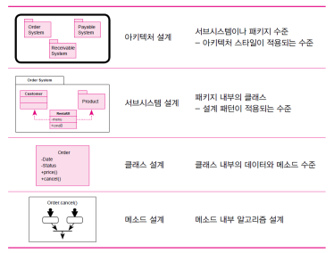

# ✅ 디자인 패턴

- **디자인 패턴이란?**

  : 소프트웨어 설계에서 자주 발생하는 문제에 대한 일반적이고 반복적인 해결책을 말한다. 여러가지 상황에 적용될 수 있는 일종의 템플릿

- **디자인 패턴 구성 요소**
    - `패턴의 이름과 소개`
    - `해결하는 문제 및 배경` : 패턴이 사용되는 분야 또는 배경
    - `솔루션` : 패턴을 이루는 요소들, 관계, 협동과정예제 – 적용 사례
    - `예제` : 적용 사례
    - `관련 패턴` : 패턴에 대한 추가 설명 및 예제 코드 등
    
    > 💡 **싱글톤 패턴
    반복자 패턴
    어댑터 패턴
    데코레이터 패턴
    팩토리 메소드 패턴
    추상 팩토리 패턴
    상대 패턴
    옵서버 패턴**

## 🔽 싱글톤 패턴

- 객체를 강제적으로 하나만 생성하려는 목적
    - 예: DB 커넥션을 위한 인터페이스, 한 클래스에 대해 생성된 객체수를 제한
- `방법`
    - 클래스에 대하여 생성된 유일한 객체를 반환하는 정적 메서드를 사용하여 접근하게한다
    - 생성자는 private으로 선언하여 객체를 접근하는 정적 메서드가 클래스의 인스턴스를 만들거나 유일하게 접근할 수 있게 하여야 한다.
- `관련 패턴`
    - 싱글톤 패턴은 추상 팩토리 패턴과 함께 사용되어 최대 하나의 팩토리 클래스가 생성되도록 보장할 수 있다

## 🔽 반복자 패턴

- 집합 클래스의 자료구조와 상관없이 집합에 소속된 요소들을 쉽게 접근하기 위하여 반복자에게 위임한다
- 클라이언트가 특정 집합의 유형과 유형별로 접근하고 집계 하는 방법을 신경 쓰지 않아도 된다

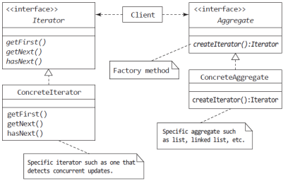

## 🔽 어댑터 패턴

- 어떤 클라이언트가 요구하는 인터페이스와는 다른 인터페이스를 가진 서비스가 있는 경우 어댑터 패턴을 사용하여 사용 가능한 서비스의 인터페이스를 클라이언트가 예상하는 인터페이스에 맞게 조정할 수 있다
    - 서비스가 제공하는 인터페이스를 클라이언트가 기대하는 인터페이스로 변환

  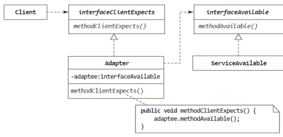

## 🔽 데코레이터 패턴

- **객체의 결합을 통해 기능을 동적으로 유연하게 확장 할 수 있게 해주는 패턴**
    - 즉, 기본 기능에 추가할 수 있는 기능의 종류가 많은 경우에 각 추가 기능을 Decorator 클래스로 정의 한 후 필요한 Decorator 객체를 조합함으로써 추가 기능의 조합을 설계 하는 방식
- `수정에 의한 추가` : 개방폐쇄 원리(OCP 원리)에 위배
- `상속에 의한 추가` : 기능의 조합 수 만큼의 서브클래스가 필요

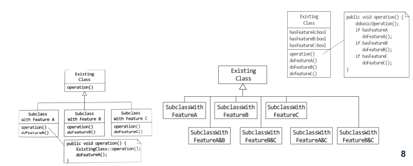

- **구성요소** : 장식 대상 component 클래스와 확장 기능이 담긴 데코레이터
- 데코레이터 객체가 재귀 합성으로 component 객체를 래핑

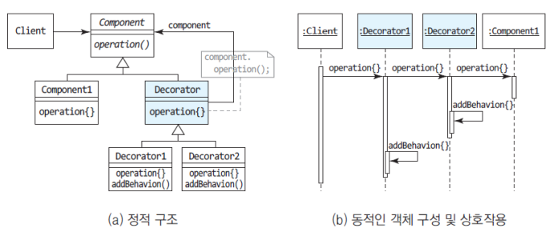

## 🔽 팩토리 메소드 패턴(템플릿 메서드 패턴)

- 어떤 작업을 처리하는 일부분을 서브 클래스로 캡슐화해 전체 일을 수행하는 구조는 바꾸지 않으면서 특정 단계에서 수행하는 내역을 바꾸는 패턴
    - 즉, 전체적으로는 동일하면서 부분적으로는 다른 구문으로 구성된 메서드의 코드 중복을 최소화 할 때 유용하다
- 클라이언트에서 사용할 클래스의 객체를 생성하는 책임을 분리하여 객체 생성에 변화를 대비
- 객체를 생성하기 위한 팩토리 메소드(createProduct)를 포함하는 추상 클래스를 정의

  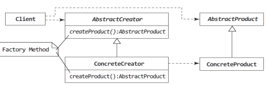

## 🔽 추상 팩토리 패턴

- 구체적인 클래스에 의존하지 않고 서로 연관되거나 의존적인 객체들의 조합을 만드는 인터페이스를 제공하는 패턴
    - 즉, 관련성 있는 여러 종류의 객체를 일관된 방식으로 생성하는 경우에 유용하다
- 객체를 사용할 클라이언트에서 구체적인 객체 생성을 지정하는 책임을 분리하기 위하여 추상 인터페이스를 이용하여 관련 객체 패밀리를 생성

  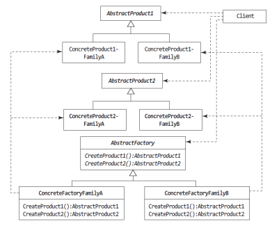

## 🔽 상태 패턴

- 스테이트 패턴은 객체가 특정 상태에 따라 행위를 달리하는 상황에서, 자신이 직접 상태를 체크하여 상태에 따라 행위를 호출하지 않고, 상태를 객체화 하여 상태가 행동을 할 수 있도록 위임하는 패턴
    - 즉, 객체의 특정 상태를 클래스로 선언하고, 클래스에서는 해당 상태에서 할 수 있는 행위들을 메서드로 정의
- 상태에 따라 객체의 동작을 변경해야 하는 경우
- 맥락과 상태를 별도로 구현하여 융통성을 달성하기 위한 체계적이고 느슨한 결합 방식

  

## 🔽 옵서버 패턴

- 한 객체의 상태 변화에 따라 다른 객체의 상태도 연동되도록 일대다 객체 의존 관계를 구성 하는 패턴
    - 데이터의 변경이 발생했을 경우 상대 클래스나 객체에 의존하지 않으면서 데이터 변경을 통보하고자 할 때 유용하다
- 데이터를 보관하고 있는 Subject가 그 데이터를 이용하는 옵서버와 효과적으로 통신하면서 느슨하게 결합
    - Subject 클래스 – 옵서버 목록을 유지, 변경을 고지
    - Observer 클래스 – 변경을 통지 받고 접근을 요청

      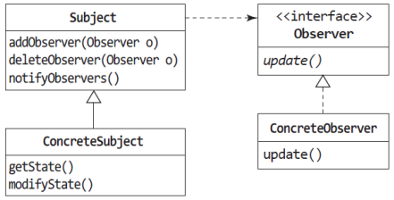

# ✅ 클래스 설계

- 분석 단계에서 아직 확정되지 않은 클래스 내부 부분 중 구현에 필요한 중요한 사항을 결정하는 작업
    - 클래스 추출 및 클래스 간 관계 분석
- 속성과 오퍼레이션의 관계를 상세히 설계해야 함
- 클래스가 가지는 속성 값에 따라 오퍼레이션 구현이 달라짐
    - 객체의 상태 변화 모델링 필수

## 🔽 클래스 인터페이스의 정의

- 왜 클래스의 인터페이스 정의가 중요한가
    - 클래스 구현
    - 클래스 사용
    - 클래스 확장

  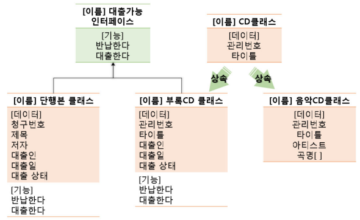

- 협약에 의한 설계(Design by Contract)
    - 소프트웨어 컴포넌트에 대한 정확한 인터페이스 명세를 위하여 선행조건, 결과조건, 불변조건을 나타내는 설계 방법
    - 선행조건(precondition) : 오퍼레이션이 호출되기 전에 참이 되어야 할 조건
    - 결과조건(postcondition) : 오퍼레이션이 수행된 후 만족하여야 하는 조건
    - 불변조건(invariant) : 클래스 내부가 실행되는 동안 항상 만족하여야 하는 조건, 리스트에 있는 노드가 항상 오름차순으로 되어야 함

### ✔ 클래스 상태 모델링

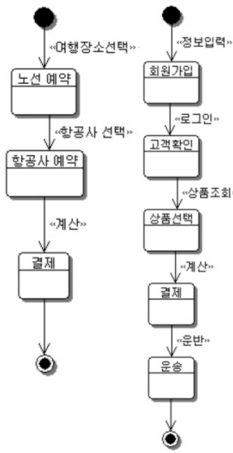

- 클래스 상태와 오퍼레이션을 상세하게 표현해야 한다
    - 클래스 내에서 한 상태에서 다른 상태로의 상태 이동을 유발하는 이벤트를 표시
    - 상태 및 이벤트의 네트워크
    - 클래스가 수신한 자극, 응답 및 조치를 캡처
    - 각각의 상태는 하나 이상의 이벤트를 수신하며 이벤트를 수신할 때 클래스가 다음 상태로 상태 전이
    - 다음 상태는 이벤트에 따라 결정
    - 상태 다이어그램을 모델링하면 시스템에서 중요 클래스의 동적 동작을 이해하는데 도움
    - 중요 클래스 : 중요 업무를 수행하는 클래스를 의미 시스템 또는 비즈니스 이벤트에 따라 종종 상태를 변경

### ✔ 클래스 재사용

- 클래스 재사용에 있어서 상속 관계 이외에 컴포지션(composition)
- 컴포지션이 필요한 이유
    - 기존의 (변경 가능성 적은) 코드와 호출할 때 일시적인 결과 값을 그 때 그 때 쓸 수 있게 코드를 짜두는 것이 좋다.
    - 그렇게 하기 위해서는 여러 생성자를 만들어 두고 원할 때 원하는 값을 뽑을 수 있게 컴포지션을 이용한다.

### ✔ 상속과 컴포지션

- 다음의 조건들을 모두 만족하다면, 안전한 상속을 구현할 수 있다.
    - 서브 클래스가 슈퍼 클래스의 진정한 서브타입인 경우(“is‐a” 관계)
    - 모든 서브 클래스 객체가 진정한 슈퍼 클래스 객체인가? (Yes)
    - 같은 패키지 내에 있고 슈퍼 클래스가 상속을 위해 설계되었는가? (Yes)
    - 슈퍼 클래스 API에 결함이 있는가? (있다면 서브 클래스에도 영향을 줌)
- 만족하지 못한다면 컴포지션을 쓰는게 좋음
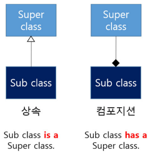