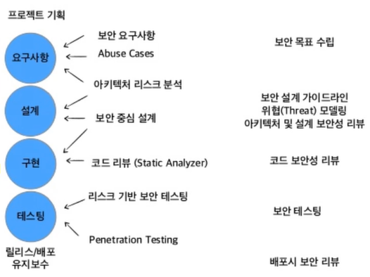
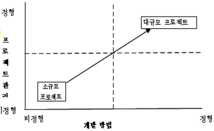
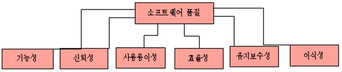
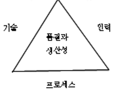

- 소프트웨어와 관련된 질문들
    - 소프트웨어 시스템을 개발하는 데 드는 비용 중 **프로그래밍에 드는 비용**은 어느정도인가?

      **20**, 30, 40, 50%

    - 중간 사이즈의 소프트웨어 시스템을 개발할 때 **한 프로그래머가 일년에 만드는 실행코드**는 평균 몇 줄이나 될까?

      **5000줄 이하**, 5000~10000줄, 10000~15000줄, 15000줄 이상

    - 사용자에게 배달되는 소프트웨어 시스템의 실행코드 **1000줄당 예상되는 오류의 개수**?

      **4개 미만**, 4~6개, 7~9개, 10개이상

    - 사용자가 발견하는 소프트웨어 시스템의 **오류는 어떤 것에 기인**하는 경우가 많을까?

      **설계의 오류**, 프로그래밍의 오류, **제안서상에서 사용자 요구사항에 대한 잘못된 이해**, 테스팅의 오류

    - 소프트웨어 시스템을 **유지, 보수**하는 데 드는 비용이 **개발비용의 몇배**?

      0.5, 1, 1.5, **2**

- **프로그램 개발 비용 : A (20%)**
    - 소프트웨어 시스템은 물리적이기보다는 논리적인 요소들로 구성
    - 건축의 시공에 해당되는 프로그래밍에 전체  **개발 비용의 약 20%**가 소요
        - 40-50%가  프로그래밍 이전 단계에 소요
        - 그래서 **요구사항 분석과 설계가 중요**!
    - 하드웨어의 경우 제조과정에서 품질 보증의 문제가 나타나지만 SW의 경우 제조과정이 따로 존재하지 않음. → **건축이나 하드웨어는 제조되는 반면 SW는 엔지니어링 되는 것**

- **프로그래머의 생산성 : 5000줄 이하**
    - 한 프로그래머가 평균 하루에 10줄 정도의 프로그램을 작성
    - **한 프로그래머가 일년에 만드는 실행코드 3-4000줄 실행코드 작성**
    - 통신 시스템의 일부인 교환기 SW나 운영체제 SW는 사무처리용 소프트웨어보다 줄당 4배 이상의 비용이 소요됨
- **프로그램의 오류 : 4개 미만**
    - 1000줄의 실행코드에 약 50~60개 정도임.
    - 완료되어서 배포 후 발견되는 오류는 평균 4개 이하
    - 오류의 종류에 따라 커다란 문제점을 내포 : SW의 많은 오류가 제품의 출고 이후에 발견
    - **출고 이전에 효과적으로 결함을 찾아내어 여과시키는 것**은 SW의 품질보증을 위해 필수적
    - 오류발견 시점과 소요비용(사례)

      대형사고

        1. 렉서스 자동ㅊ 급발진 사고원인은 전자제어장치에 내장된 SW결함
        2. 보잉 비행기 추락 원인은 받음각 센서의 SW오류로 사고

- **사용자가 발견하는 오류** :  **설계의 오류, 제안서상에서 사용자 요구사항에 대한 잘못된 이해**
    - 개발에 있어 가장 어려운 문제는 **사용자가 무엇을 원하는지 정확히 정의 내리는 일**

      **SW개발은 무엇을 만들 것인가, 사용자에게 어떤 기능과 편리함을 제공할 수 있는가를 빠르고 효과적으로 파악하는 데 달려있다.**

    - 목표가 정확히 분석되어 있지 않은 상황에서 개발에 들어간다면 시스템이 제대로 만들어질 확률이 떨어짐.

      →개발도중 새로운 요구사항이 계속적으로 추가되면 설계가 안돼서 큰일남

      → 프로그래밍을 **서둘러 시작할수록 더 오랜 시간이 걸려서** 늦게 끝나게 됨.

    - 개발 이전 목표를 구체적으로 확립하는게 성공의 열쇠

- **개발 비용과 유지보수 비용 : 2배**
    - SW를 개발하는 비용에 비해 개발된 소프트웨어를 유지, 보수하는 관리비용이 더 많이 들어감.

      →개발 중에는 유지보수 비용이 과소평가될 수 있음.

      → 유지, 보수에 들어가는 비용은 얼마나 체계적으로 만들어졌냐에 반비례.

      **33 = 개발비용, 67 = 유지보수 비용(2배)**

- Security by Design ⇒ Security Engineering
    - Security by Design = 보안 내재화, 보안 공학

      → *보안공학*? : 제품의 품질을 높이기위해 수학적으로 적합한 보안 분석과 설계를 **소프트웨어 공학에 통합시키는 것**

    - **실수가 발생해도 품질을 유지하는 것이 품질 보증성, 해킹에 견디는 것이 보안성이라면 신뢰성, 안전성에 도달하기 위해서는 이 두가지 모두 보장된어야한다.**

- **보안공학**

  

- 프로그래머와 엔지니어의 차이점?

  > Problem Solving
  >

  프로그래머는 번역가와 같다. 실제로 필요한 시스템을 기계어로 바꿔주는것임

  엔지니어는 아예 새로운 것을 창조해내는 것을 말함

    - 품질 좋은 sw를 함께 개발할 수 있는 스킬을 개발하고 그걸 기반으로 프로젝트 싸이클을 경험한 사람이 엔지니어란느 것
    - SW 개발
        - 프로그래밍 - 상상력, 구현력(프로그램 능력)
    - 경험이 중요함
        - 문제의 발생부터 분석, 통합
        - 검증
- **다루는 문제에 따라 또 접근방법이 달라짐**

  

- SW 공학 주요 목적 :
    - **품질과 생산성**
        - 엔지니어링 작업에서는 비용, 일정, 품질과 같은 변수가 중요함
        - **비용** : Man-Month로 측정 ( 인건비와 직결 )
        - **일정**: 짧은 time-to-market(기술의 급격한 발전에 따라 갈수록 짧아짐)
        - **품질(품질도 어떤 것을 포함하는지 알아야한다.)**

      

    - **일관성과 재현성**
        - **일관성**

          → 프로젝트의 결과를 어느정도 정확하게 예측가능하게

          → **더 높은 품질의 제품을 생산 (기관/회사는 일관성 있는ㄴ 품질 수준을 유지)**

        - **프로세스의 표준화가 필요**
        - **재현성**

          → 개발한느 시스템마다 높은 품질과 생산성을 갖도록 만드는 것

          → 개발능력, 결과의 재현성 → **일관성과 유사한 개념**

- SW 공학의 접근방법(**단계적인 접근방법이 필요**)
    - 프로젝트를 수행하는 동안 얻은 품질과 생산성은 여러 요인에 의해 좌우됨
    - **품질을 좌우하는 세 가지**
        1. 인력
        2. 프로세스
        3. 기술

  → 프로젝트 삼각 균형

  

    - 높은 품질과 생산성은 좋은기술, 좋은 프로세스, 잘 훈련된 인력을 사용해서 얻을 수 있음.
    - **SW공학은 SW 제작과정에 집중**
    - **적절한 “ 소프트웨어 프로세스 “의 설계와 관리는 SW공학의 중요 연구목표임**
- SW엔지니어링 작업의 종류
    - **소프트웨어 개발 프로세스** - 시스템에 대한 비전과 개념을 목표로하는...
    - **품질 보증** - SQA 개발 작업이 적절히 수행되었는지 확인
    - **프로젝트 관리** : 개발과 품질 보증 작업을 관리하고 감독