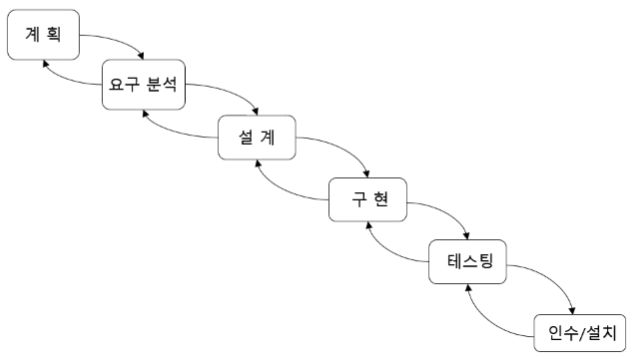
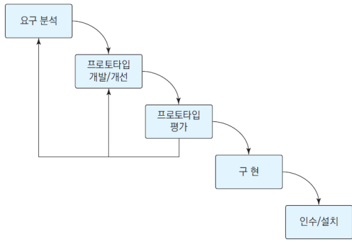
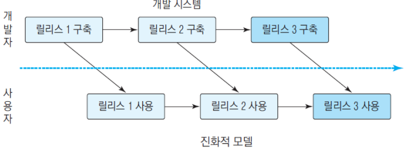
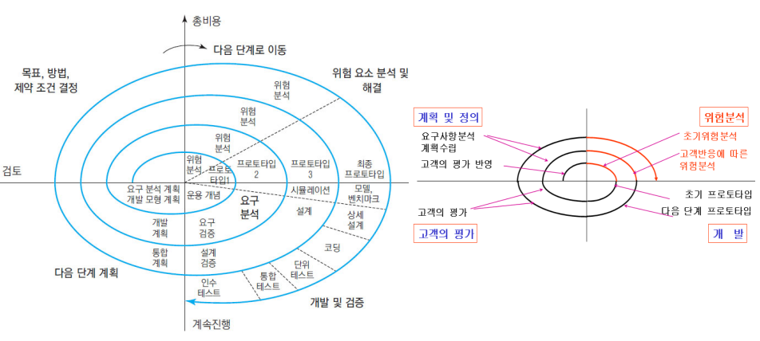
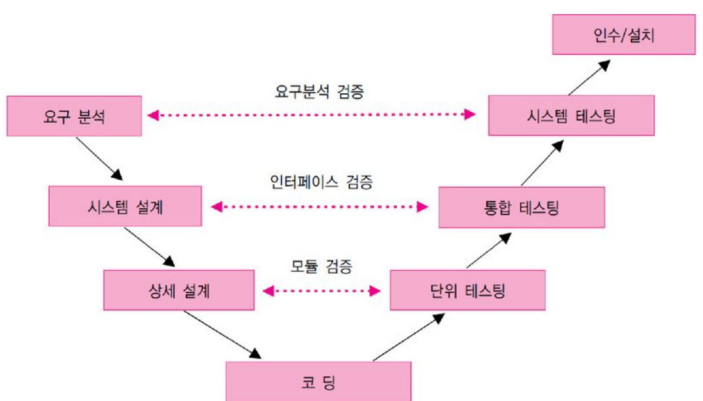

# 소프트웨어 프로세스 모델

## 폭포수 모델

→ 순차적으로 진행해나가는 방식

### 폭포수 모델

- 항공방위 소프트웨어 개발 경험으로 습득
- **순차적** : 각 단계 사이에 중복이나 상호작용이 없음 (**전체 계획이 중요함!**)
- 각 단계의 결과는 다음 단계가 시작 되기 전에 점검하고 바로 전단계로 피드백
- 단순하거나 응용 분야를 잘 알고 있는 경우에 적합(한번의과정, 비전문가가 사용할 시스템 개발에 적합)
- **결과물 정의가 중요**하다.

> **핵심 -> 1. 순차적이다.  2. 전체 계획이 중요.  3. 결과물 정의가 중요.**

### 폭포수 모델의 단계 별 결과물

> Software Concept
Statement of Work (SOW-Statement of Work)

> Requirements

> Analysis

> Design

> Coding and Debugging

> Systems Testing

> Deployment & Maintenance

### 폭포수 모델의 단계 별 결과물

- **장점**
    - 프로세스가 단순하여 초보자가 쉽게 적용 가능
    - 중간 산출물이 명확, 관리하기 좋음
    - 코드 생성 전 충분한 연구와 분석 단계
- **단점**
    - 처음 단계의 지나치게 강조하면 코딩, 테스트가 지연
    - 각 단계의 전환에 많은 노력
    - 프로토타입과 재사용의 기회가 줄어듦
    - 소용 없는 다종의 문서를 생산할 가능성 있음
- **적용**
    - 이미 잘 알고 있는 문제나 연구 중심 문제에 적합
    - 변화가 적은 프로젝트에 적합

## 프로토타이핑 모델
Rapid Prototyping Model(RAD) 라고도 함

### 프로토타이핑 모델

- 프로토타입(시범 시스템)의 적용
    - 사용자의 요구를 더 정확히 추출
    - 알고리즘의 타당성, 운영체제와의 조화, 인터페이스의 시험 제작
- 프로토타이핑 도구
    - 화면 생성기
    - 비주얼 프로그래밍, 4세대 언어 등
- 공동의 참조 모델
    - 사용자와 개발자의 의사소통을 도와주는 좋은 매개체
- 프로토타입의 목적
    - 단순한 요구 추출 – 만들고 버림
    - 제작 가능성 타진 ‐ 개발 단계에서 유지보수가 이루어짐

### 프로토타이핑 모델의 장단점

- **장점**
    - 사용자의 의견 반영이 잘 됨
    - 사용자가 더 관심을 가지고 참여할 수 있고 개발자는 요구를 더 정확히
      도출할 수 있음
- **단점**
    - 오해, 기대심리 유발
    - 관리가 어려움(중간 산출물 정의가 난해)
- **적용**
    - 개발 착수 시점에 요구가 불투명할 때
    - 실험적으로 실현 가능성을 타진해 보고 싶을 때
    - 혁신적인 기술을 사용해 보고 싶을 때

##진화적(Evolutionary) 모델
- 개발 사이클이 짧은 환경
    - 빠른 시간 안에 시장에 출시하여야 이윤에 직결
    - 개발 시간을 줄이는 법 –시스템을 나누어 릴리스

### 진화적 모델

- **릴리스 구성 방법**
    - *점증적 방법* : 기능별로 릴리스
    - *반복적 방법* : 릴리스 할 때마다 기능의 완성도를 높임
- **단계적 개발**
    - 기능이 부족하더라도 초기에 사용교육 가능
    - 처음 시장에 내놓는 소프트웨어는 시장을 빨리 형성 시킬 수 있음
    - 자주 릴리스 하면 가동 중인 시스템에서 일어나는 예상하지 못했던 문제를 신속 꾸준히 고쳐나가기 가능
    - 개발 팀이 릴리스마다 다른 전문영역에 초점을 둘 수 있음.

## 나선형(Spiral) 모델

- 소프트웨어의 기능을 나누어 **점증적으로 개발**
    - 실패의 위험을 줄임
    - 테스트 용이
    - 피드백
- 여러 번의 점증적인 릴리스
- **Bohem이 제안**
    - 진화단계
        - 계획 수립(planning) : 목표, 기능 선택, 제약 조건의 결정
        - 위험분석(risk analysis) : 기능 선택의 우선순위, 위험요소의 분석
        - 개발(engineering) : 선택된 기능의 개발
        - 평가(evaluation) : 개발 결과의 평가

### 나선형(spiral) 모델의 장단점

- **장점**
    - 대규모 시스템 개발에 적합 (**risk reduction mechanism**)
    - 반복적인 개발 및 테스트 (**강인성 향상**)
    - 한 사이클에 추가 못한 기능은 다음 단계에 추가 가능
- **단점**
    - 관리가 중요
    - 위험 분석이 중요
    - 새로운 모형
- **적용**
    - 재정적 또는 기술적으로 위험 부담이 큰 경우
    - 요구 사항이나 아키텍처 이해에 어려운 경우

## V(Verification) 모델

### V 모델

- **폭포수 모형의 변형**
    - 감추어진 반복과 재 작업을 드러냄, **작업과 결과의 검증**에 초점
- **장점**
    - 오류를 줄일 수 있음
- **단점**
    - 반복이 없어 변경을 다루기가 쉽지 않음
- **적용**
    - 신뢰성이 높이 요구되는 분야