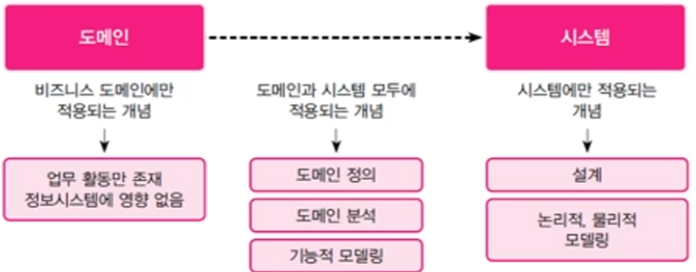
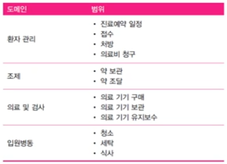
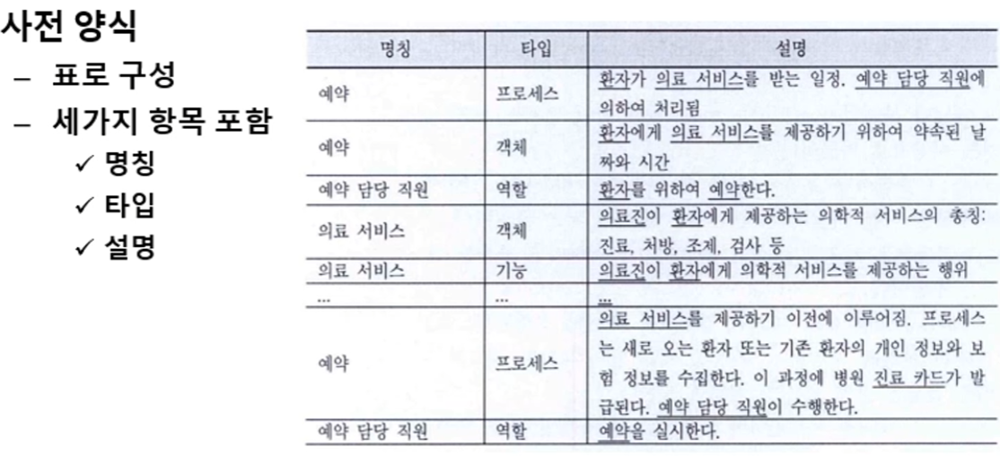

### 도메인 분석

- 도메인 : 요구의 배경
- 설계 모델링에 필요한 **여러개념과 비즈니스 룰**을 파악
- 응용 분야에 존재하는 **개념을 잘 정의 하고 분석**하여 시스템에 존재하는 개념으로 정립하는 단계

### 1. 도메인 정의

- 업무작업 영역을 파악하고 범위를 규정 : 정보 시스템을 구축하는데 필요한 개념적인 프레임워크 제공
- **서브시스템이라고 생각하면 됨.**
- 넓은 범위의 개념을 더 좁은 범위의 지식들로 체계홯하는 작업

### 2. 도메인 분석

- 도메인 배경파악
- 도메인 개념
    - 도메인의 목적, 구조, 동작을 구성하는 **객체, 프로세스, 사람, 룰** 같은 것임. (* 객체는 하나의 클래스를 이루는 것을 말함, *** 프로세스 : 이런 것들이 어떻게 흘러가는지 정리, *** 사람: 액터, ***룰: 규칙)
    - 도메인 개념을 발견을 위한 주의사항
        - 요구의 **핵심**을 발견해야함
        - 요구가 해결될 것 같은 문제를 발견
        - **문제의 요소**를 발견
        - 관련된 도메인의 개념을 발견

### 3. 도메인 사전

- **도메인 개념을 조직화한 결과물**
- 각 항목은 **용어**가 사용될 때는 언제든 같은 의미로 통하게하는 **간결한 정의**
- 요구, 인터뷰, 메뉴얼로 추출
- 도메인 정의에서 표현된 문장, 어절, 제목에 초점을 두고 개념을 추출
- 진료와 검사 의료서비스의 성격에따라 의사, 간호사,검사원이 환자에게 적절한 예약된 의료 서비스를 제공
- **도메인 개념, 의료서비스, 의사, 간호사, 검사원 ,환자, 예약**

### 4. 비즈니스 규칙

- **업무에서 지키기로 한 규정**
- **정책, 규정, 절차, 가이드라인, 표준**의 집합
- 사용자에게 요구해도 준비된 전체 목록을 받기 어려움
- 종류

  – 사실(fact) – 개념이 무엇인지 설명
  – 추론(inference) – 다른 사실로 부터 얻은 사실
  – 액션 구동자(action enabler) – 조건이 일치되면 액션이 수행
  – 제약(constraints) – 시스템이나 외부 요소가 수행할 또는 수행하지 않을제약을 가하는 규칙
  – 계산(computation) – 공식이나 알고리즘