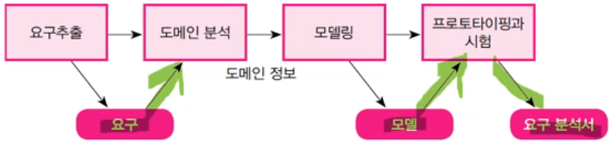
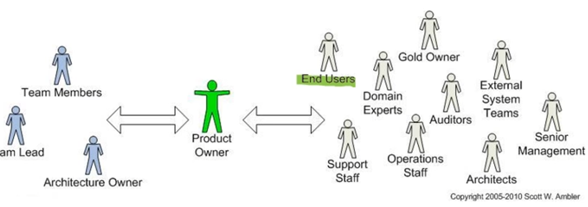

- 소프트웨어에서 가장 중요한 단계
- 솦프트웨어 프로젝트 계획 이후에 소프트웨어 시스템이 가져야할 기능이나 성능 등의 특징을 찾아내서 이것을 분석하고 정리해서 요구사항으로 잘 정리 한 것

## 요구분석

- 소프트웨어 개발의 실질적인 첫 단계
- 사용자의 요구에 대해서 이해하고 정리한느 작업
- 두 가지 작업
    - 현재의 상태를 파악하고 요구를 정의
    - 명세서 작성
- 요구의 변경은 파급 효과가 큼

## 요구분석 과정

1. 요구추출 - 기능적인 요구와 기능 이외의 조건 추출
2. 도메인 분석 - 요구에 대한 정보를 수집하고 배경 분석
3. 모델링 - 도메인 분석을 통해 얻은 자료를 개념화
4. 프로토타리핑과 시험 - 분석된 기능적 요구의 타당성 시험을 위한 프로토타입 생성
5. 문서화 검토 - 요구분석서를 작성

## 요구

- 시스템이 제공해야할 역량
- 외형적으로 나타내는 기능이나 성능

## 요구와 연관된 사람들

- **End Users : 최종적으로 이 서비스를 사용할 사람**
- Domain Experts : 도메인 관련한 약관 등을 관리해줄 전문가들

→ 이처럼 정말 많은 유형의 사람들이 관련되어 있기 때문에 요구사항을 아주 정확하게 추출해내는 것이 중요함.

## 기능적 요구

- 시스템과 외부 요소들 간의 인터랙션 (사용자들에게 보여주는 서비스)
- 시스템이 어떤 상태일 때 외부의 데이터나 명령에 대해 어떤 반응을 하는지 기술
- 기능적 요구 항목으로 제기되는 문제들은 사용자의 문제를 해결하기 위한 구현 가술과는 독립적인 사항

### 기능적 요구사례

특성, 자료, 입출력, 사용자

## 기능적 외적 요구(성능)

- **비기능적 요구** : 시스템 구축에 대한 **성능, 보안, 품질, 안전** 등에 대한 요구사항
- **성능** - 시스템의 처리량(1분당 몇개를 처리하는지, 반응 속도가 어떤지..)
- **품질** - 신뢰성, 가용성, 사용시 오류 발생률
- **안전** - 의도하지 않은 오퍼레이션으로 인해서 원치 않는 상태에 있는 것을 방지하는 역량
- **보안** - 시스템의 자원을 악의적인 공격으로부터 보호할 수 있는 역량
- **사용성** - 인터페이스. 동작, 보고 느끼는 것