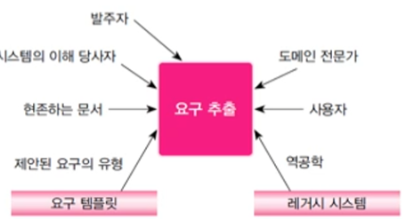
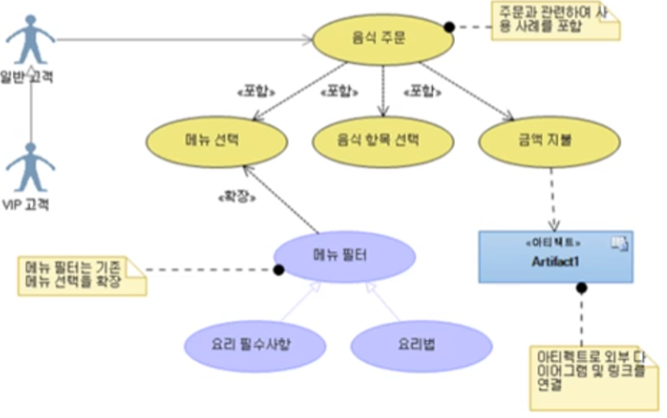

## 요구 추출의 어려움

- 개발 팀이 응용 도메인에 대해서 충분히 알지 못함.
- 고객과 사용자가 소프트웨어가 무엇을 하는지 또한 어떻게 요구를 표현할지 모름
- **공통 배경지식 부족**으로 개발 팀과 사용자 사이의 **대화 장벽**이 생김
- 소프트웨어 요구에 대한 명세와 구현이 분리 될 수 없어 정확히 명시하기가 어려움 (그래서 요구에 대한 명세를 아주 확실하게 정확하게 정해놔야함**, 요구 추출할때는 어떻게가 아니라 무엇을 추출 해야하는지를 결정하는 것이다. Not How, WHAT!)**
- 요구 추출 작업을 관리자, 사용자, 개발자 모두 **과소평가하는 경우**가 많음.
- 비기능적 요구를 파악하고 이해하지 못함.
- **요구가 계속해서 변경**됨

## 요구 추출

- **추출 세 가지 단계**
    - 응용에 대한 **정보 출처 파악 (* 정보출처 : 다양한 이해관계자들의 요구를 파악하는 것.)**
    - 응용 대한 **정보 취합**
    - **요구와 제한 사항의 정의**
- 정보수집 방법
    - 고객의 발표, 문헌 조사, 업무 절차와 양식 조사,
    - 관련자들 설문지, 사용자와의 인터뷰, 브레인 스토밍 회의, 사용 스토리 또는 사용사례 작성

## 요구 우선순위

- 우선 순위에 따른 요구 구별
    1. **절대적으로 필요한 요구**
    2. 용망되나 꼭 필요한 것은 아닌 요구
    3.  요구로 판단될 수 있으나 제외될 수돌 있는 요구

## 요구 정보 출처

- 정보출처 유형
    - 고객(혹은 나 자신)
    - **도메인 전문가** - 비즈니스 도메인을 지원하는 시스템을 구축하기 위해 필요한 사람
    - **이해당사자**(stakeholder) - 시스템 운용으로 인해 영향 받는 사람
    - **사용자(end user)** : 시스템을 직접 사용하는 사람
    - 역공학 : 이미 있는 시스템들을 잘 분석

    

## 정보 수집 방법
- **고객의 발표**
  - 개발팀이 구축하는 시스템에 대해 **초기에 개념을 잡을 수 있음**
  - 효과적인 가이드라인

    – 고객 업무를 잘 알고 있는 운영 책임자나 관리자가 발표
    – 발표하기 전 개발 팀원이 필요한 정보가 있는지 검토
    – 의심이 가는 부분을 **질문하여 명확히 할 것**
    – **구현과 관련된 토의는 배제**
    – 발표 내용의 복사본을 팀원과 공유
    – 2시간 이상의 발표회는 지양

- **문헌 조사**
  - 유사한 프로젝트를 조사 (현재 개발할 시스템에 대한 통찰 제공)
  - **업무문서나 양식**을 조사(현재 업무나 시스템 정보에 대해 깊은 이해가능)
  - 산업 및 기업 표준 조사 → 도메인 전문가 같은 사람들ㅇ
  - 관련 정부 **정책/규제** 조사
- **업무 절차와 양식조사**
  - 업무 관련 문서, 절차, 양식, 운영 메뉴얼 조사
  - 내부 표준 조사
  - 정부, 산업, 기억의 특수정책이나 규정 조사
- **관련자들 설문지**
  - 관리자나 사용자와 같은 이해 당사자를 대상
  - 이해 당사자들이 의사결정 과정에 포함
  - 무기명 설문 :  감추어진 정보를 끌어내기 쉬움
  - 유의사항 : 질문은 간단 중요이슈에 집중
- **사용자와의 인터뷰**
  - 가이드라인

    – 가능하면 많은 당사자와 인터뷰
    – 여유로운 인터뷰 일정
    – 인터뷰 약속 시간을 넘기더라도 여유롭게
    – **중요한 관련자**와는 여러 차례 인터뷰

- **브레인 스토밍 회의**

  아이디어를 낼 목적으로 여러 명으로부터 정보를 얻기 위한 회의
  훈련된 요원이 주재
  토론보다는 **아이디어를 쏟아놓는 회의, 익명성 보장**
  서로 자극이 되어 열정을 가지고 아이디어를 창안
  JAD(Joint Application Development) – 집중 브레인스토밍 세션

- **프로토타이핑**
  - 프로토타입 : 최종 시스템의 예상 기능 중 일부를 빠르게 구현한 프로그램
  - 가장 단순한 형대 : paper prototype
  - 가장 흔한 형태 : 모의 사용자 인터페이스
- **사용 스토리 또는 사용사례 작성**
  - **USECASE 유즈케이스**
    - 어떤 기능이 있고 어떻게 흐름이 구성되어있는지까지 다 나와있음.
    - 최근에는 **애자일 프로세스가** 유즈케이스로 많이 쓰임

    

  - **사용자 스토리 (개발자에게 모든 것을 맡기는 경우임)**
    - 사용자/개발팀간의 대화를 이끌어내는 도구
    - **사용자들이 시스템에 바라는 역량 및 기능을 간단히 기술**
    - 하지만 기능만 기술이 되어있기 때문에 어떤 기능이 어떤 흐름을 가지고 이용할 수 있는 지를 정의하지 못함.